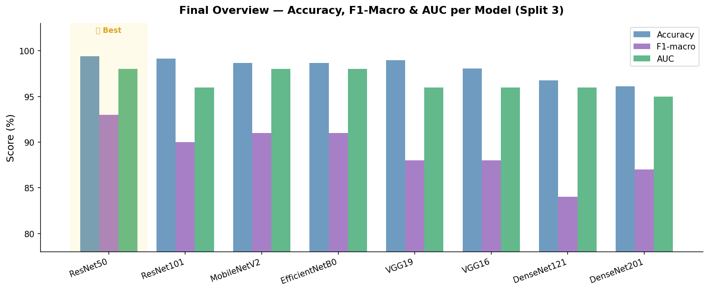

#  PneumoCNN4 — Pediatric Pneumonia Detection from Chest X-Rays

> Deep learning system for automated classification of pediatric chest X-rays (Normal vs. Pneumonia), using 8 pre-trained CNN models with systematic comparison across dropout configurations and dataset splits.

**Master's graduation project** | Université Saad Dahleb de Blida, Algeria | June 2025  
**Author:** Beloufa Dania | Electronic Instrumentation (Master's with distinction)  
**Supervised by:** Dr. Reguieg F. Zohra & Pr. Benblidia Nadjia

---

## 📌 Overview

Pneumonia kills over 748,000 children under 5 every year worldwide. In Algeria alone, acute respiratory infections account for 30% of pediatric consultations and 23.7% of hospitalizations in children under 5. Yet diagnosis remains challenging due to variability in X-ray quality, shortage of specialized radiologists, and hospital pressure during epidemics.

**PneumoCNN4** is an intelligent diagnostic support system that automatically classifies pediatric chest X-rays as **Normal** or **Pneumonia**, using transfer learning from 8 state-of-the-art CNN architectures, plus a custom hybrid model.

---

## 🗂️ Repository Structure

```
PneumoCNN4/
├── README.md
├── requirements.txt
├── .gitignore
│
├── data/
│   └── README.md              # Dataset description + Kaggle download link
│
├── notebooks/
│   ├── 01_preprocessing.ipynb # Data cleaning, augmentation, 3-split strategy
│   └── 02_results_comparison.ipynb  # All model results, charts, confusion matrices
│
├── src/
│   ├── train.py               # Training script (configurable model + dropout)
│   ├── evaluate.py            # Evaluation metrics + confusion matrix export
│   └── utils.py               # Data loaders, augmentation helpers
│
├── results/
│   ├── figures/               # ROC curves, confusion matrices, bar charts
│   └── metrics_summary.csv    # All results in one table
│
└── models/
    └── README.md              # Links to saved weights (Google Drive / HuggingFace)
```

---

## 📁 Dataset

**Source:** [Kaggle — Chest X-Ray Images (Pneumonia)](https://www.kaggle.com/datasets/paultimothymooney/chest-xray-pneumonia)

- Pediatric X-ray images from a hospital in Guangzhou, China
- **5,856 total images** | 2 classes: Normal / Pneumonia
- Original split is highly imbalanced → 3 custom repartitions explored

### Dataset Splits

| Split | Train Normal | Train Pneumonia | Val Normal | Val Pneumonia | Test Normal | Test Pneumonia |
|-------|-------------|-----------------|------------|---------------|-------------|----------------|
| Split 1 | 1,341 | 3,875 | 8 | 8 | 234 | 390 |
| Split 2 | 1,341 | 3,875 | 120 | 120 | 122 | 278 |
| Split 3 | 3,875 | 3,875 | 372 | 372 | 182 | 182 *(balanced)* |

> Split 3 uses a fully balanced test set to ensure unbiased evaluation.

---

## 🏗️ Architecture

### Transfer Learning Head (added to all 8 base models)

```
[Pre-trained CNN base — frozen layers]
         ↓
  Dense(256, ReLU)
         ↓
     Dropout(p1)
         ↓
  Dense(128, ReLU)
         ↓
     Dropout(p2)
         ↓
  Dense(2, Softmax)
```

### Models Evaluated

| Family | Models |
|--------|--------|
| VGG | VGG16, VGG19 |
| ResNet | ResNet50, ResNet101 |
| Lightweight | MobileNetV2, EfficientNetB0 |
| Dense | DenseNet121, DenseNet201 |
| Hybrid | EfficientNetB0 + MobileNetV2 |

### Hyperparameters

| Parameter | Value |
|-----------|-------|
| Optimizer | Adam |
| Learning rate | 1e-5 |
| Batch size | 32 |
| Epochs | 10–20 |
| Image size | 224×224 px |
| Augmentation | Rotation, zoom, horizontal flip |

---

## 📊 Results — Best Configuration per Model (Split 2)

| Model | Dropout 1 | Dropout 2 | Accuracy | F1 (macro) | AUC | Loss |
|-------|-----------|-----------|----------|------------|-----|------|
| **VGG16** | 70% | 70% | 97.00% | 96% | 96% | 0.050 |
| **VGG19** | 20% | 50% | 98.00% | 89% | 95% | 0.050 |
| **ResNet50** | 20% | 50% | 98.70% | 89% | 96% | 0.004 |
| **ResNet101** | 30% | 50% | **99.32%** | 88% | 97% | 0.020 |
| **MobileNetV2** | 20% | 20% | 98.97% | 87% | 94% | 0.028 |
| **EfficientNetB0** | 20% | 20% | 96.79% | 86% | 97% | 0.085 |
| **DenseNet121** | 20% | 50% | 96.10% | 84% | 94% | 0.099 |
| **DenseNet201** | 70% | 70% | 97.62% | 82% | 95% | 0.068 |

### 🏆 Best Individual Model: ResNet50 (Split 2)

```
Accuracy:      99.41%
AUC:           98%
F1-Score:      92–95% (per class)
Recall:        92–95% (per class)
Loss:          0.0215
```

ResNet50's **residual connections** allow very deep feature learning while avoiding gradient degradation — a key advantage for subtle radiographic patterns.

### 🥇 Best Overall: Hybrid Model (EfficientNetB0 + MobileNetV2)

```
Precision — Normal: 0.99 | Pneumonia: 0.94
Recall    — Normal: 0.94 | Pneumonia: 0.99
F1-Score  — Normal: 0.96 | Pneumonia: 0.97
AUC:         100%
Accuracy:     99%
```

The hybrid model achieves the best balance between precision and recall for both classes, critical in a medical screening context.

---

## 🔑 Key Findings

- **Higher dropout is not always better**: Dropout at 70%/70% caused severe performance drops in MobileNetV2 and DenseNet121 (F1 macro as low as 0.66), while lower dropout (20%/50%) consistently outperformed.
- **ResNet50 > ResNet101** on this task: deeper does not mean better when training data is limited.
- **Balanced test split (Split 3)** gave more reliable inter-model comparisons than the original imbalanced split.
- **Hybrid model** outperformed all individual architectures, reaching AUC = 100% on the balanced test set.

---

## ⚙️ Installation & Usage

```bash
# Clone the repository
git clone https://github.com/daniabel90/PneumoCNN4.git
cd PneumoCNN4

# Install dependencies
pip install -r requirements.txt

# Train a model (example: ResNet50, dropout 20%/50%)
python src/train.py --model resnet50 --dropout1 0.2 --dropout2 0.5 --split 2

# Evaluate
python src/evaluate.py --model resnet50 --weights models/resnet50_best.h5
```

---

## 📦 Requirements

```
tensorflow>=2.10
keras
numpy
pandas
opencv-python
scikit-learn
matplotlib
seaborn
jupyter
```

---

## 📈 Evaluation Metrics

- **Accuracy** = (TP + TN) / (TP + TN + FP + FN)
- **Precision** = TP / (TP + FP)
- **Recall** = TP / (TP + FN)
- **F1-Score** = 2 × (Precision × Recall) / (Precision + Recall)
- **F1-Score macro**: unweighted average across both classes
- **AUC-ROC**: area under the receiver operating characteristic curve
- **Confusion matrices** for each model and configuration

---

## 🔭 Future Work

- Multi-class classification (bacterial vs. viral pneumonia, bronchiolitis, etc.)
- Integration into a mobile or web interface for clinical use
- Explainability via Grad-CAM heatmaps to support radiologist interpretation
- Validation in real clinical conditions in Algerian hospitals

---

## 📚 References

- WHO Pneumonia Fact Sheet: https://www.who.int/fr/news-room/fact-sheets/detail/pneumonia
- Kaggle Dataset: Chest X-Ray Images (Pneumonia) by Paul Mooney
- Keras Applications: https://keras.io/api/applications/

---

## 📄 License

This project is for academic and research purposes. Dataset usage is governed by the original Kaggle license.

---

*Graduation project — Master's in Electronic Instrumentation, Université Saad Dahleb de Blida, June 2025*
